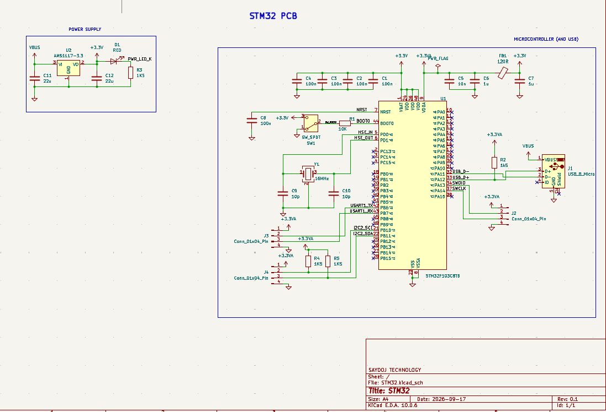
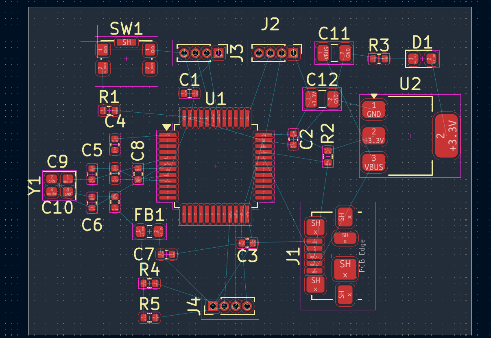
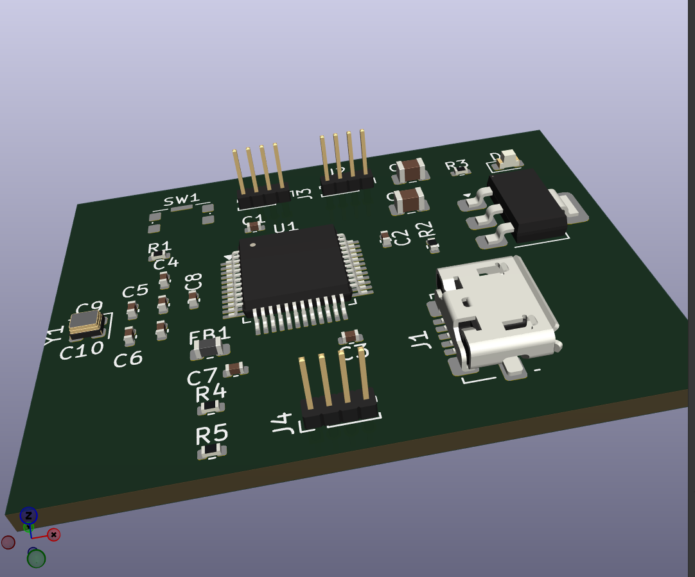

# STM32 PCB Design

Custom STM32 microcontroller board designed in KiCad. This project includes the schematic, PCB layout, and 3D render, with power integrity analysis covering decoupling capacitors and ferrite bead usage.

## Project Images

### Schematic

### PCB Layout

### 3D Render

---

# What is decoupling capacitors? 
A decoupling capacitor (or bypass capacitor) sits between the power supply pin ($V_{CC}$) and ground ($GND$) of an integrated circuit (IC) to isolate the chip from noise on the power rail and maintain stable operating voltage.

**Key Functions:**

* **Supplying Instantaneous Current:** When digital ICs switch states rapidly, they demand sudden bursts of current. Power supplies and long PCB traces cannot deliver current instantly due to trace inductance. The decoupling capacitor acts as a tiny, local energy reservoir, discharging immediately to prevent voltage dips (sags).
* **Filtering High-Frequency Noise:** Power supply lines act as antennas, picking up electromagnetic interference (EMI) and ripple. Because capacitive impedance decreases as frequency rises ($Z = \frac{1}{2\pi f C}$), high-frequency noise sees the capacitor as a short circuit and shunts safely to ground rather than entering the IC.
* **Preventing Inter-Component Crosstalk:** Noise generated by one switching IC can travel back into a shared power trace and disrupt neighboring components. Decoupling isolates (decouples) each component, keeping switching noise contained to its local loop.

**Operational Summary:**

| Circuit Condition | Capacitor Behavior | Impact on the IC |
| --- | --- | --- |
| **Steady DC Supply** | Blocks DC current (acts like an open circuit). | Normal power reaches the IC uninterrupted. |
| **High-Frequency AC Noise** | Offers low impedance to ground. | Shunts unwanted power noise away from sensitive pins. |
| **Transient Current Demand** | Rapidly discharges stored charge. | Keeps local supply voltage stable during logic transitions. |

**Placement & Sizing Guidelines:**

* **Physical Proximity:** Placement is critical. Decoupling capacitors must sit **as close as physically possible** to the IC's power and ground pins. Long traces introduce stray inductance, which degrades high-frequency performance.
* **Typical Capacitor Values:**
* **0.1 µF (Ceramic):** Standard choice for filtering high-frequency noise and fast switching spikes.
* **10 µF (Tantalum/Electrolytic):** Placed centrally as a "bulk" capacitor to smooth out lower-frequency, higher-energy voltage fluctuations across an entire circuit block.

---

# What is ferrite bead?
Assuming you mean a **ferrite bead**, it is a passive electronic component used to suppress and dissipate high-frequency electromagnetic noise in power supply lines and signal traces.

**Key Functions:**

* **Frequency-Selective Noise Dissipation:** At DC and low frequencies, a ferrite bead acts like a simple, low-resistance conductor, letting power or signals pass through unimpeded. At high frequencies (typically 10 MHz to over 1 GHz), its impedance spikes dramatically and it acts as a resistor, converting unwanted high-frequency noise energy into harmless heat.
* **Blocking EMI & RFI:** It prevents Electromagnetic Interference (EMI) and Radio Frequency Interference (RFI) from entering sensitive ICs or radiating outward into surrounding electronics.
* **Power Rail Isolation:** In mixed-signal designs, ferrite beads are placed inline on power traces to isolate noisy digital power rails from noise-sensitive analog power rails (such as audio, sensor, or RF sections).

**Ferrite Beads vs. Decoupling Capacitors:**

While decoupling capacitors and ferrite beads both fight high-frequency noise, they work in opposite ways and are often paired together:

| Component | Placement | Mechanism | Primary Job |
| --- | --- | --- | --- |
| **Decoupling Capacitor** | Parallel (Pin to Ground) | Shunts noise to ground ($Z \to 0$ at high frequencies). | Local energy storage & noise bypass. |
| **Ferrite Bead** | Series (Inline with Signal/Power) | Blocks noise inline and turns it into heat ($Z \to \text{high}$ at high frequencies). | High-frequency noise suppression & rail isolation. |

**Common Real-World Uses:**

* **L-Filters & Pi ($\pi$) Filters:** Combined with decoupling capacitors on both sides, a ferrite bead creates a multi-stage low-pass filter that provides near-total power supply isolation for sensitive chips.
* **Cable Chokes:** The thick plastic cylinder (clamshell choke) found near the end of laptop chargers or USB cables contains a ferrite core. It stops the cable from acting as an antenna that radiates high-frequency noise into the room.
* **Surface-Mount (SMD) Beads:** Tiny chip-sized ferrite beads soldered directly onto PCBs right before power enters high-speed microcontrollers or wireless modules.

---

# References

* [KiCad Documentation](https://docs.kicad.org/)
* [STMicroelectronics STM32 Documentation](https://www.st.com/en/microcontrollers-microprocessors/stm32-32-bit-arm-cortex-mcus.html) 
